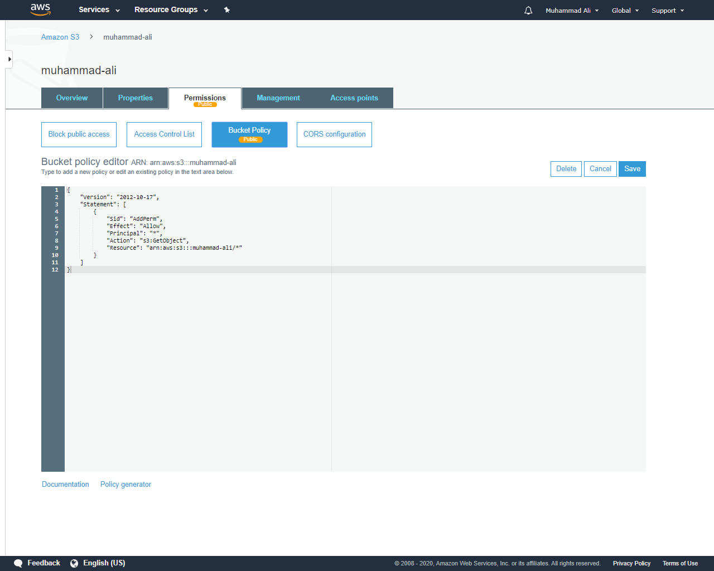

# Static Blog Deployment

## Udacity Cloud Dev Ops Engineer Nanodegree Project 01

Deploy a static website to AWS using S3, IAM and CloudFront.

## CloudFront endpoint

<a href="drnt6corwizy8.cloudfront.net" target=_blank>drnt6corwizy8.cloudfront.net</a> 

Published website available <a href="http://muhammad-ali.s3.amazonaws.com/index.html" target=_blank>here</a>

## Steps / Proof

S3 Bucket created

S3 Bucket created screen shot

Files uploaded to S3 bucket

"Files uploaded to S3 bucket screen shot"

S3 bucket set to support static web hosting

S3 bucket set to support static web hosting screen shot

S3 bucket is publicly accessible

S3 bucket is publicly accessible screen shot

CloudFront configured to retrieve and distribute website files

CloudFront configured to retrieve and distribute website files screen shot

Also, updated the default root object to `index.html` so that it automatically redirects to the website.

CloudFront configured default root object screen shot

"Rendering perfectly on the browser